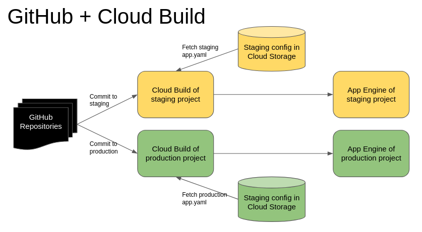
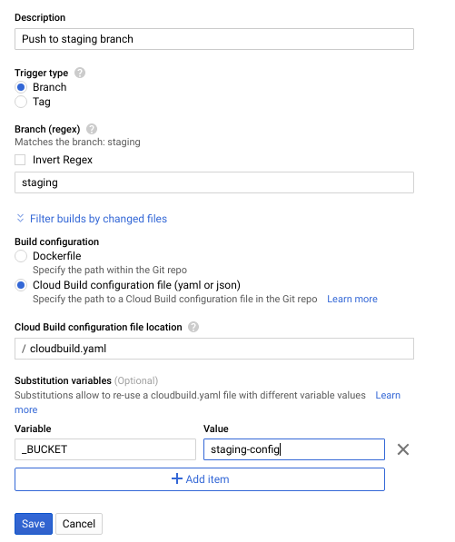

+++
author = "Chaoming Li"
title = "Automate Deployments to Multiple App Engine Environments with Cloud Build and GitHub"
description = "A step-by-step guide on how to deploy to staging and production App Engine environments by committing to git branches with Cloud Build and Github."
date = "2019-07-16"
categories = [
    "DevOp"
]
tags = [
    "github",
    "cloud build",
    "deploy",
    "golang",
    "php",
    "appengine",
    "google cloud platform",
    "gcp"
]
image = "1_UzYiagjfQwOZTlIwmCqKOQ.png"
+++

If you want to securely automate deployments of your App Engine application to multiple environments such as staging and production with a simple Git commit or a pull request, this article will outline the steps for you.

## Why You Should Do This:

Good reasons to automate the deployment process are:

- Reduce the impact of human error on a deployment
- Improve security by not including any credentials or sensitive configuration settings in the source code
- Restrict permission to deploy to certain environments (e.g. production) with a process
- Streamline the deployment process and gain the benefits of automation (e.g. testing)

## Assumptions:

I am not going to discuss how to set up Git repositories and GitHub accounts. There are plenty of tutorials online for those topics.

In this article, I’ll only assume that you have an App Engine application. I have used this process for Golang and PHP, but it will work for Python and other languages.

## Step 1: Enable Branch Restrictions

In your GitHub repository, you need to have some branches, at least a staging branch and a master branch. The workflow is that a developer can commit to the staging branch. It will automatically deploy the application to a staging App Engine environment.

After the application is tested in the staging environment:

- The developer will create a pull request
- The administrator will merge it with the master branch
- The automation will deploy the application to the production environment

This workflow is a bit oversimplified. But the point is: Only someone with permission can deploy the application to the production by committing to the master branch. This can be achieved with [branch restrictions](https://help.github.com/en/articles/enabling-branch-restrictions).



## Step 2: Move All Environment Related Configurations to app.yaml

It’s very common for an application to have environment variables for configuration and secrets such as database credentials, domains, GCP key files, etc. Some of these details are security-critical so they should never be included in the source code. If you have embedded them into part of the source code, it’s time to remove them and put them into the app.yaml file that is kept outside of the repository and only is used during deployment.

In your app.yaml file, you can have these variables as environment variables in the following syntax:

```yaml
env_variables:
  DOMAIN: 'staging.mydomain.com'
  DEBUG_MODE: true
  MYSQL_DSN: 'blah blah'
```

The App Engine platform will take these values from app.yaml and make them available to your application, which can read the environment variables to ensure your application has the correct settings.

Depending on which language your application is written in, there are different ways to read the environment variables. Here is the link to Python and other languages (click on the language links at the top of the content to switch to your preferred language): [https://cloud.google.com/appengine/docs/standard/python/config/appref](https://cloud.google.com/appengine/docs/standard/python/config/appref)

In PHP, use:

```php
getenv('VAR NAME')
```

I don’t think $_ENV works.

If you need app.yaml for your local environment, just make sure the file is in .gitignore so it won’t be included in the repository.

Once you have put the environment variables into the staging app.yaml file, upload it to a Google Cloud Storage bucket and make sure it’s not available to the public (by default it isn’t). Do the same for the production app.yaml but use a different bucket.

## Step 3: Create Your Cloud Build for Staging

In GCP, Cloud Build can trigger a deployment from Git commits to a certain branch. The web UI is very simple to follow to create the trigger. The trick is to have a variable called _BUCKET which is the bucket name that contains your app.yaml



And, you need a cloudbuild.yaml file in your Git repository to control the deployment process. Below is a simple cloudbuild.yaml file that does two things:

- Copy the app.yaml file from the bucket
- Deploy the application

```yaml
steps:
- name: gcr.io/cloud-builders/gsutil
  args: ['cp', 'gs://$_BUCKET/app.yaml', 'html/app.yaml']
- name: 'gcr.io/cloud-builders/gcloud'
  args: ['app', 'deploy', 'html/']
```

You can see that I use $_BUCKET in the cloudbuild.yaml file as the bucket name of the app.yaml file. This means when I configure the production Cloud Build trigger, the same cloudbuild.yaml will work without any modification.

Now, commit to your staging branch, and you will see Cloud Build is triggered and starts the deployment process automatically.

## Step 4: Grant Permissions to Cloud Build

The deployment is likely to fail because Cloud Build doesn’t have the permissions to access Cloud Storage, App Engine, etc.

Go to IAM web UI in your GCP project, and change the permission settings of the Cloud Build service account to grant it App Engine Admin and other relevant permissions for completing the deployment. Now, retry the deployment in Cloud Build, you should see the successfully deployed message in the logs.

## Step 5: Repeat Step 3 and Step 4 for Production

Just repeat the above two steps in the production project. Make sure the production app.yaml is in the Cloud Storage bucket for production, and the Cloud Build trigger _BUCKET variable is pointing to the production bucket as well.

Because only the system administrator is able to commit to production, as a developer, you should create a Pull Request in the GitHub repository to merge your changes from the staging branch into the master branch. Once the Pull Request is approved and merged, it will trigger the Cloud Build deployment process in the production project.

Conclusion:

This approach not only streamlines the deployment process, but it also makes it more secure and reliable.

If you have any feedback or questions, please feel free to comment below.