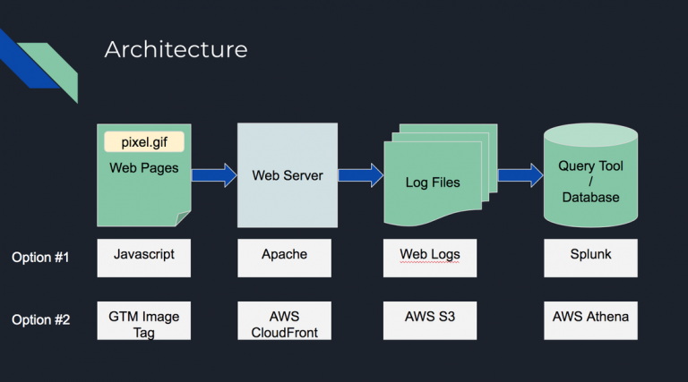
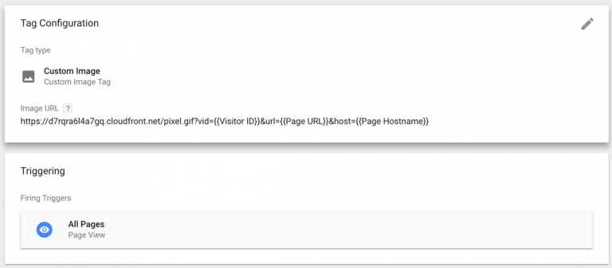

+++
author = "Chaoming Li"
title = "Build Your Own Web Analytics Platform in 25 Minutes"
description = "Building a simple web analytics data pipeline on AWS can be a fun project for anyone who wants to learn about data pipelines."
date = "2018-02-20"
categories = [
    "Big Data"
]
tags = [
    "aws",
    "cloudfront",
    "s3",
    "google tag manager",
    "gtm",
    "athena",
    "sql",
    "web analytics"
]
image = "screenshot-2018-02-24-19-46-41_orig-768x427.png"
+++

I gave a presentation in MeasureCamp Melbourne, and the topic was “Build Your Own Web Analytics Platform in 25 Minutes”. In MeasureCamp, each session has 25 minutes of presentation time, that’s where the 25 minutes on the topic from. What inspired me to do this talk was a conversation in Measure Slack about sending Google Analytics data into your own database. And I think it is an interesting thing to do to build a web analytics platform from scratch without spending a lot of time and money.

Building your own web analytics platform can be much simpler than you would think. In this presentation, there is pretty much no coding knowledge required. If you are familiar with AWS S3 and CloudFront, it is very simple. If not, don’t worry, AWS has a really good interface so you just need to click through a series of buttons. Below is the high-level architecture of the platform. Option #1 was something I built in my previous job for production support. It was not based on any cloud so it was able to store personally identifiable information (PII) and the production support team used it to help to recreate scenarios for debugging. Option #2 is the solution in this presentation, which uses AWS cloud so all the infrastructure can be set up in minutes. You will need to have an AWS account to do it. You can [sign up for a free account here](https://aws.amazon.com/free/).

The whole process includes 8 steps. I will go through all the 8 steps here.



## Step 1: Create an S3 bucket to store log files

First of all, you will need an S3 bucket to store all the log files. AWS S3 is a storage service, where you can store a lot of files in the cloud with pretty low costs. S3 buckets are like folders, you can store a group of files within.

Login to your AWS account, click on S3 in the product list menu under the Storage section and click on Create Bucket button. Give a name to the bucket, something like “my-web-analytics-logs”, and click Next all the way through. You have your S3 bucket created now.

## Step 2: Create an S3 bucket to store the tracking pixel image

Most web analytics solutions are using an invisible pixel image to track data. They attach the information to be tracked in the pixel URL as query parameters. So we need an S3 bucket to host this pixel file. Just repeat the process of step 1, but name the bucket “my-web-analytics-pixel”. Upload the pixel file to the bucket. You can grab the pixel file from [https://s3.amazonaws.com/cli-tracking-demo-pixel/pixel.gif](https://s3.amazonaws.com/cli-tracking-demo-pixel/pixel.gif)

You will need to make the pixel file public so it can be accessed from the Internet. To do so, go to the pixel bucket and tick the checkbox next to the file name, click More and select Make Public.

## Step 3: Create a CloudFront distribution and enable logging

Now, we have our pixel file in the cloud, and we are ready to store the log files. CloudFront is the CDN AWS offers. It is fast and cheap to run. The reason we want to use CloudFront here is to be able to serve the pixel file very fast, so it doesn’t impact the page performance much, and log the data at the same time. Go to CloudFront, click on Create Distribution button, and click on Get Started under the Web section to go to the form to create a distribution.

When you create the CloudFront distribution, you will need to enable logging and point to log files to the S3 bucket we created in step 1.

You will also need to point the origin to the S3 bucket containing the pixel file so your CloudFront distribution can serve the pixel file. You can leave all the other options as default.

After these 3 steps are completed, you are ready to take in whatever data and store it. We should start to work on the part to generate data.

## Step 4: Create a visitor ID via GTM

To track the same visitors across a period, you need a cookie to store a unique random visitor ID. In Google Tag Manager (GTM), go to Variables, and create a custom Javascript variable and name it “Visitor ID”. Copy and paste the code below to the variable. This piece of code will check if the visitor already has a visitor ID cookie “v_id”. If yes, it will read it, refresh the cookie for another 2 years, and return the visitor ID value. Otherwise, it will create a random ID and save it to “v_id” cookie for 2 years, and return the newly created visitor ID value. We will use this value in the next step.

```jsx
function(){
  var readCookie = function(key){
    var result;
	return (result = new RegExp('(?:^|; )' + encodeURIComponent(key) + '=([^;]*)').exec(document.cookie)) ? (result[1]) : null;
  }
  var writeCookie = function(name, value, domain, expire){
    document.cookie = name+"="+value+";domain=."+domain+";path=/;expires="+expire;
  }
  var visitorId = readCookie('v_id');
  var date = new Date();
  if(visitorId === null){
    visitorId = date.getTime().toString(16) + (Math.floor(Math.random() * (999999 - 100000) + 100000)).toString(16);
  }
  date.setTime(date.getTime() + (2 * 365 * 24 * 60 * 60 * 1000));
  writeCookie('v_id', visitorId, location.hostname, new Date(date).toUTCString());
  return visitorId;
}
```

## Step 5: Create an image tag in GTM and attach data in the URL query parameters

We are going to use the pixel file in this step. Create an image tag in GTM. In the URL field, put in “https://your-cloud-front-distribution.cloudfront.net/pixel.gif?vid={{Visitor ID}}&pageUrl={{Page URL}}”, set the trigger as All Pages. `{{Visitor ID}}` is the variable created in the previous step, and I attached the page URL in the query parameters in this example but you can attach whatever variables in your GTM as key-value pairs in the same way.



## Step 6: Publish GTM

By now, all the data collection and storage is set up. Once you publish GTM to your websites, data will start to flow in soon. The way it is set up in this demo doesn’t support real-time data streaming, so you will need to wait a few minutes to have your first log file deposited in the S3 bucket.

## Step 7: Create an Athena table schema

After the data files are in your S3 bucket, you can start to query the data. AWS Athena is probably the fastest way to do so if you like to use SQL. I prefer to create a table manually in Athena than using the crawler feature because I found the crawler is not always working properly in my experience.

To manually create a table in Athena, you will need to point the table to your log file s3 bucket and define all the fields in the table. You can find [the CloudFront log file format here](https://docs.aws.amazon.com/AmazonCloudFront/latest/DeveloperGuide/AccessLogs.html). There are 25 fields, so take your time to go through them one by one. In my demo, I only created the first 12 fields because that’s good enough for the demo, and the 12th field is the one stores the query parameter data. Here is a screenshot of the fields in my table.


## **S**tep 8: Check your data

You can use “select * from database_name.table_name” to inspect all the data you have in the log files. Spend some time learning your data, you have the IP address, the user agent string, and the data you send through from the pixel.

Here is the SQL to count visitors by page URLs and sort the results in descending order. The example uses the `url_extract_parameter` function to get the value out of the query parameters by name. This function only works for full URLs, so I have to concatenate some fields to recreate the full URLs to allow the function to work properly,

```sql
SELECT
  COUNT(DISTINCT VisitorID) AS Visitors,
  PageUrl
  FROM (
    SELECT
      url_extract_parameter(RequestURL, 'vid') AS VisitorID,
      url_decode(url_extract_parameter(RequestURL, 'url')) AS PageUrl
      FROM (
        SELECT
          'https://' || "cs-host" || "cs-uri-stem" || '?' || "cs-uri-query"  AS RequestURL
        FROM
          "webanalytics"."logs"
      )
  )
GROUP BY
  PageUrl
ORDER BY Visitors DESC
```

## Conclusion

By now, you have a very simple web analytics platform that can take in whatever data you want to track as long as you have it in your GTM variables. This is just a super-simplified demo of how web analytics platforms work in principle. There are a lot of missing parts such as cross-domain tracking, data enrichment, data visualisation, etc. However, it is also very flexible because it is not limited by any platform. You have the freedom to design what to track.

I hope this article helps you understand how web analytics platform collects data at a high level, and feel free to extend it to other usages like tracking non-web data.