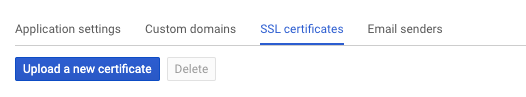
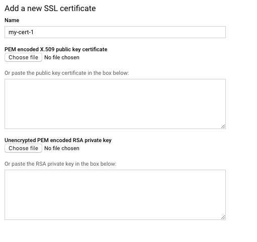
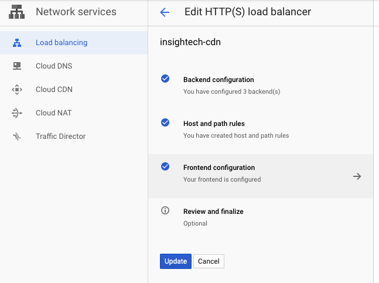
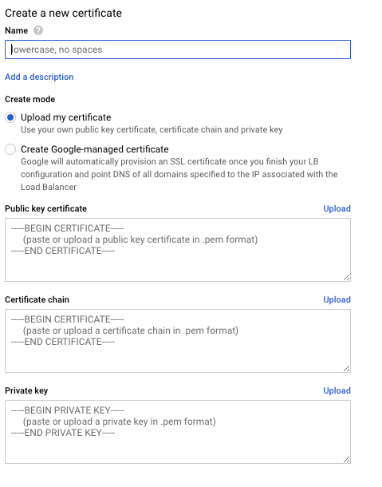

+++
author = "Chaoming Li"
title = "How to Install Custom SSL Certificate on Google Cloud Platform"
description = "A step-by-step guide on how to install custom SSL certificates in Google Cloud Platform (GCP) for both App Engine and load balancer."
date = "2019-05-24"
categories = [
    "DevOp"
]
tags = [
    "deploy",
    "ssl",
    "certificate",
    "appengine",
    "load balancer",
    "cdn",
    "google cloud platform",
    "gcp"
]
image = "1_NG0OmIlxq8M686LHMQHJvg.jpeg"
+++

I recently installed custom SSL certificates in Google Cloud Platform (GCP) for both App Engine and load balancer (used by CDN and Computer Engine). Here is the step-by-step guide on how it’s done. I hope this will help you to go through the process.

## Generating a certificate signing request

To get a certificate, firstly, you need to generate a certificate signing request to your SSL certificate issuer so that they can provide you with a valid certificate. Here is the command using OpenSSL to do it.

```
openssl req -new -newkey rsa:2048 -nodes -keyout server.key -out server.csr
```

Input the relevant information and put your domain name in Common Name, it will generate two files: server.key which is your private key, and server.csr which is the certificate signing request.

## Get your SSL certificate

Provide your certificate issuer with your CSR file, they will generate your SSL certificate. Usually, this process only takes a few minutes. However, the process varies depending on which issuer you are going to use.

The format of the certificate can also be different depending on the issuer. I got the X.509 certificate in a crt file in this case.

## Convert your private key to PEM format

If you only need to put your certificate in the GCP load balancer, you can skip this step as it doesn’t need a PEM format certificate. This is for App Engine. I don’t get why Google can’t just let me manage all my certificates in one place and in one format. This is actually a bit annoying.

```
openssl rsa -in server.key -out server.key.pem
```

## Upload certificate and PEM key to App Engine

In the App Engine settings interface, click on the SSL certificates tab and you can upload a certificate.



That will bring up this interface where you can copy and paste your certificate and private key.



Give your certificate a name. I usually put the year it is issued in it so that when I need to renew it next year, I will have a good idea of which certificate is for which year.

Copy and paste your X.509 certificate file content and the PEM format private key content in the two boxes. Click “Upload” to save the certificate and key. It will ask you to enable SSL for the custom domains you have in App Engine. Just pick the relevant domains of the certificate.

This change will take about 10 minutes or more to become effective. You can verify that by checking your domain’s SSL certificate with any browser. It’s better to check it with all major browsers to make sure they like your certificate.

## Upload certificate to the GCP load balancer

To upload a certificate to the GCP load balancer, you need to go to Network services then edit your load balancer. Then click on Frontend configuration and you will be able to edit the port 443 configuration settings where you can manage your SSL certificates.



After clicking on “Create a new certificate” in the Certificate dropdown list, you will see the interface to copy and paste in your certificate, certificate chain (root certificate), and the private key.



Once the certificate is created in the system, you can assign it to the load balancer and GCP will ask if you want to delete your unassigned certificate. My suggestion is that only delete it after you can confirm the new certificate is working without any issue.

Similar to App Engine, the new certificate will only take effect after about 10 minutes or so. Verify it with all major browsers to make sure they like it.

In my experience missing the certificate chain can cause issues with some browsers but Chrome might not mind it.

## Conclusion:

Enabling SSL certificates in GCP load balancer and App Engine is fairly simple if you know about the process. Once you know how to navigate through the GCP UI to do it, it’s fairly straightforward.

Again, I think GCP should have a centralised place to manage all the certificates so you can just pick them up in the different products. That will save some effort.

Leave a comment if you have questions on install SSL certificate on GCP.