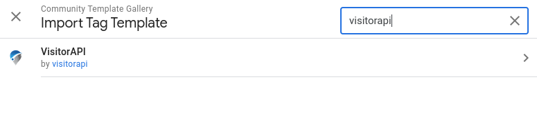
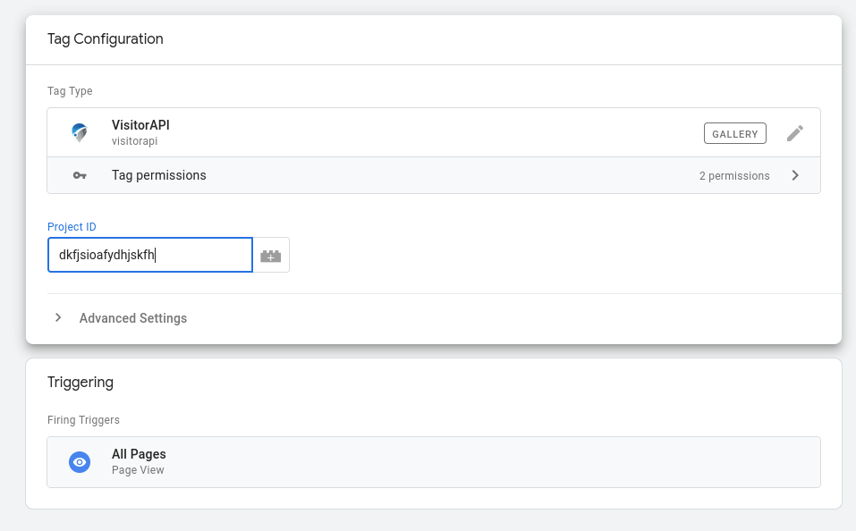
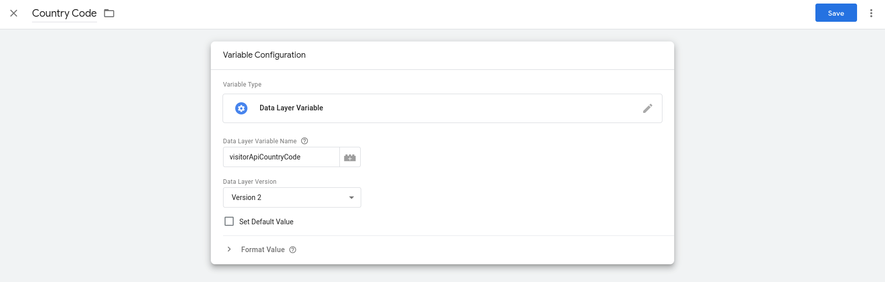
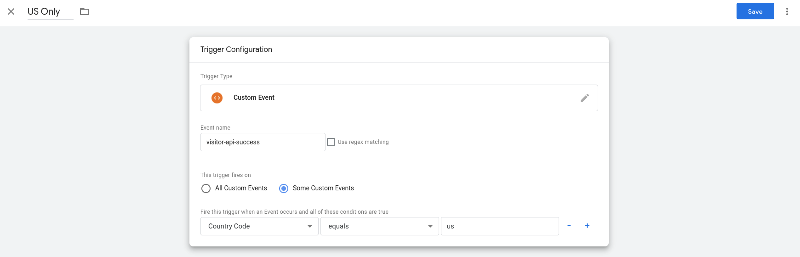

+++
author = "Chaoming Li"
title = "How to trigger marketing tags based on visitor location in GTM"
description = "This article will show you how you can trigger marketing tags based on visitor location with custom location variables in Google Tag Manager."
date = "2022-07-07"
categories = [
    "Digital Marketing"
]
tags = [
    "digital markeeting",
    "marketing tag",
    "google tag manager",
    "gtm",
    "location",
    "country"
]
image = "syj23egvntavpv64up1t.webp"
+++

Location variables are not built-in variables in Google Tag Manager (GTM). This article will show you how you can trigger marketing tags based on visitor location by using VisitorAPI in GTM.

First, import the VisitorAPI tag template to your GTM container by clicking **Templates** → **Search Gallery**, then search for “visitorapi” to import the tag template to your GTM container.

Once the tag template is imported, create a new tag with the VisitorAPI tag template, and put in your VisitorAPI project ID. To get a VisitorAPI project ID, sign up for an account and create a free or paid project in VisitorAPI. Don’t forget to add your website domains to the authorised domain list in your VisitorAPI project to make the API works for your website.

The VisitorAPI tag will call the API to retrieve the visitor’s location data including country, state and city, and trigger a new event “visitor-api-success” which you can use to trigger the tags that are targeting certain locations.

To use the location variables, you will need to create them in your GTM container. VisitorAPI returns the country, state and city of the visitors. Here is how to create those three variables: click **Variables** → **New**, then select **Data Layer Variable**. Name your variables as “Country Code” and input “visitorApiCountryCode” to the **Data Layer Variable Name** field.

Here is a list of all the variables VisitorAPI returns

| GTM Variable Name | Data Layer Variable Name | Description |
| --- | --- | --- |
| IP Address | visitorApiIpAddress | The IP address of the visitor. |
| Country Code | visitorApiCountryCode | The country from which the visitor is located as an ISO 3166-1 alpha-2 country code. |
| Country Name | visitorApiCountryName | The full name of the country in which the visitor is located in. |
| Currencies | visitorApiCurrencies | An array of the official currencies of the country in which the visitor is located. |
| Languages | visitorApiLanguages | An array of the official languages of the country in which the visitor is located in. |
| Region | visitorApiRegion | Name of the region, state or province in which the visitor is located. The complete list of valid region values is found in the ISO-3166-2 standard. |
| City | visitorApiCity | Name of the city in which the visitor is located in. |
| City LatLong | visitorApiCityLatLong | Latitude and longitude of the city in which the visitor is located in. |
| Browser | visitorApiBrowser | The browser name which the visitor uses. |
| Browser Version | visitorApiBrowserVersion | The browser version which the visitor uses. |
| Device Brand | visitorApiDeviceBrand | The brand of the device which the visitor uses. Only applicable to mobile devices. |
| Device Model | visitorApiDeviceModel | The model of the device which the visitor uses. Only applicable to mobile devices. |
| Device Family | visitorApiDeviceFamily | The family of the device which the visitor uses. Only applicable to mobile devices. |
| OS | visitorApiOs | The operating system name of the device which the visitor uses. |
| OS Version | visitorApiOsVersion | The operating system version of the device which the visitor uses. |

You can use the variables in trigger conditions in your GTM container to fire the tags targeting visitors based on locations. For example, if you want to target visitors in the US, you can create a trigger with the condition “Country Code” equals “us”.

Not only you can trigger tags based on the location variables, but you can also use the variables in your tags as parameters `{{Country Code}}` to pass the data to your tags.

The location variables make it possible to personalize user experience based on visitor location by using GTM. Please feel free to leave a comment to share how you will use the location variables in GTM.