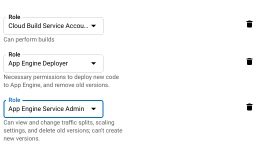

+++
author = "Chaoming Li"
title = "How to Use Docker for Go App Engine Development and Deploy to Standard Environment"
description = "This is my approach of using Docker to run my Go development environments and deploying the source code to App Engine."
date = "2018-09-17"
categories = [
    "DevOp"
]
tags = [
    "golang",
    "docker",
    "deploy",
    "appengine",
    "cloud build",
    "google cloud platform",
    "gcp"
]
image = "43219741-fdfef302-8ffc-11e8-96f4-4a2ab2ce136b_orig-500x250.png"
+++

App Engine is great but if you are using Docker, you can only use Flexible Environment which is not what I want as I would love to continue to use Standard Environment. Here is [a comparison of the two environments](https://cloud.google.com/appengine/docs/the-appengine-environments).

My goal is to use Docker for development only. When the app is deployed, it will still be deployed to App Engine Standard Environment as usual. After some researches and trial, I found a way to do so.

## Create App Engine Development Docker

After I asked on [Stackoverflow](https://stackoverflow.com/questions/53719388/is-it-possible-to-use-docker-as-dev-enviornment-for-golang-app-engine-standard-e/53722860), and thanks to [dhauptman](https://stackoverflow.com/users/8456296/dhauptman) giving me the direction, I was able to create the Dockerfile that can spin up a docker container with Google Cloud SDK and run Go App Engine development environment. Here is the Dockerfile:

```docker
FROM golang

# Install the Google Cloud SDK.
RUN echo "deb http://packages.cloud.google.com/apt cloud-sdk-jessie main" | tee /etc/apt/sources.list.d/google-cloud-sdk.list
RUN curl https://packages.cloud.google.com/apt/doc/apt-key.gpg | apt-key add -
RUN apt-get update && apt-get install google-cloud-sdk google-cloud-sdk-app-engine-python\
    google-cloud-sdk-app-engine-python-extras\
    google-cloud-sdk-app-engine-java\
    google-cloud-sdk-app-engine-go\
    google-cloud-sdk-datalab\
    google-cloud-sdk-datastore-emulator\
    google-cloud-sdk-pubsub-emulator\
    google-cloud-sdk-cbt\
    google-cloud-sdk-cloud-build-local\
    google-cloud-sdk-bigtable-emulator\
    kubectl -y

# Install go packages your app needs
RUN go get github.com/go-sql-driver/mysql
RUN go get google.golang.org/appengine
RUN go get google.golang.org/appengine/log
RUN go get google.golang.org/appengine/memcache
RUN go get google.golang.org/appengine/taskqueue

COPY ./go_app /go/src/app
EXPOSE 8080
EXPOSE 8000
CMD ["dev_appserver.py", "--host=0.0.0.0", "--admin_host=0.0.0.0", "--storage_path=~/appengine_storage", "--blobstore_path=~/appengine_blobstore", "--datastore_path=~/appengine_datastore", "--log_level=debug", "--enable_host_checking=false", "/go/src/app/app.yaml"]
```

I assume you have basic Docker knowledge so I am not going to explain the Dockerfile step by step here. One thing that cost me some time was the CMD. You must have “–host=0.0.0.0” and “–admin_host=0.0.0.0” in your CMD otherwise you will not be able to access your app engine development instances from your local environment.

To save the trouble of typing the docker run parameters. I also created a docker-compose.yaml file. But it’s not really necessary if you have only one Docker container to run.

```yaml
version: '3'

services:
    go-app-engine:
      build: .
      volumes:
        - ./go_app /go/src/app
      ports:
        - 8080:8080
        - 8000:8000
```

Now just need to use the following command to get the Go App Engine development environment up and running.

`docker-compose up`

## Deploy to App Engine Standard Environment

I don’t want to deploy Docker containers to App Engine because that allows using Flexible Environment only. I will need to find a different way to deploy to Standard Environment. Google Cloud Build is perfect for the deployment task. It can deploy code from Github repository triggered by Git push.

The solution is fairly straightforward. First, push the Go source code to Github. Git push will trigger Cloud Build to run cloudbuild.yaml and go through the steps to get the Go packages and to run the gcloud deploy command.

To do this, make sure your App Engine admin API is enabled and the App Engine is created in your project. You will also need to grant App Engine deployer and server admin permissions to the cloud build service account as below screenshot.



Here is the cloudbuild.yaml file. Similar to the Dockerfile, it specifics the steps to install the Go packages and then run the gcloud deploy command.

```yaml
steps:
- name: 'gcr.io/cloud-builders/go'
  args: ['get', 'github.com/go-sql-driver/mysql']
  env: ['GOPATH=go']
- name: 'gcr.io/cloud-builders/go'
  args: ['get', 'google.golang.org/appengine']
  env: ['GOPATH=go']
- name: 'gcr.io/cloud-builders/go'
  args: ['get', 'google.golang.org/appengine/log']
  env: ['GOPATH=go']
- name: 'gcr.io/cloud-builders/go'
  args: ['get', 'google.golang.org/appengine/memcache']
  env: ['GOPATH=go']
- name: 'gcr.io/cloud-builders/go'
  args: ['get', 'google.golang.org/appengine/taskqueue']
  env: ['GOPATH=go']
- name: 'gcr.io/cloud-builders/gcloud'
  args: ['app', 'deploy', 'go_app/']
  env: ['GOPATH=go']

artifacts:
  objects:
    location: 'gs://bucket-nam/'
    paths: ['go_app']
```

Now you just need to create the Cloud Build trigger to be triggered by Git push and run the cloudbuild.yaml to package the Go source code and deploy it to App Engine Standard Environment.

## Conclusion

This approach is great when you need to replicate the development environment without much overhead. Including the Dockerfile in the Git repository will allow new developers to set up a development environment very fast as long as Git and Docker are installed.

Deployment is fully automatic when the code is pushed to the Github repository. I am not going to talk about how to manage and review code before deployment but you will need to have quality control on the code being pushed into the Github repository anyway.

Let me know what you think or if you have any questions.